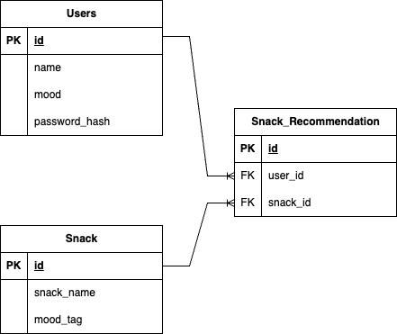

# MayaSnax

## Mission Statement

MayaSnax is an application to enable users to choose a snack that will optimally support Maya based on her mood.

Snack selection is an art, but it’s important to bring some science in as well. By removing the guesswork of attributing snacks to moods, Users can see better results of happiness by using our state-of-the-art matching algorithm.

### Who We Serve

MayaSnax aims to provide Evan, Maya's husband, with a useful tool for supporting Maya's snacking needs.

### Product Overview

**Mood Selection**: Users can select a mood to being their MayaSnax experience.
**Wide Variety of Options**: Users are presented with many possible snacks based on the provided mood.
**Feedback**: Users can provide feedback to improve the MayaSnax recommendations.

### Summary

Studies show that in times of crisis, snacks are the number one source of comfort. Meanwhile, they are ranked third in most stressful decisions according to a recent poll conducted by the White House. This has widespread impacts on the overall levels of happiness, productivity, and longevity of the citizens of the world. By addressing this highly important issue, we can curb hunger, provide peace of mind, and simplify the snacking process for all.

## Solution

### Technologies  
We built MayaSnax using the following technologies:

### ERD

To manage the data necessary for the MayaSnax backend, we have implemented the following schema in our PostgreSQL database:

